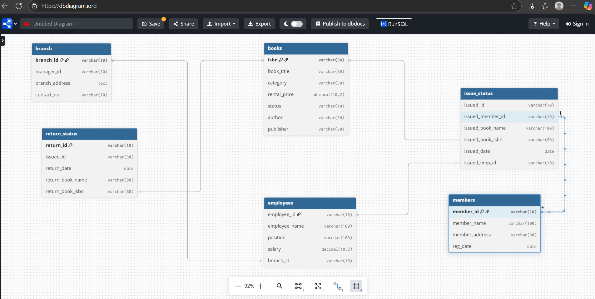

# library_management_system
The Library Management System is a database-driven application designed to manage the daily operations of a library. It keeps track of books, members, employees, and the issuing and returning of books. The system ensures smooth circulation of books and helps in monitoring availability, overdue returns, and fines.
## Project Overview

**Project Title**: Library Management System  
**Level**: Intermediate  
**Database**: `library_db`

This project demonstrates the implementation of a Library Management System using SQL. It includes creating and managing tables, performing CRUD operations, and executing advanced SQL queries. The goal is to showcase skills in database design, manipulation, and querying.


## Objectives

1. **Set up the Library Management System Database**: Create and populate the database with tables for branches, employees, members, books, issued status, and return status.
2. **CRUD Operations**: Perform Create, Read, Update, and Delete operations on the data.
3. **CTAS (Create Table As Select)**: Utilize CTAS to create new tables based on query results.
4. **Advanced SQL Queries**: Develop complex queries to analyze and retrieve specific data.

## Project Structure

### 1. Database Setup


- **Database Creation**: Created a database named `library_db`.
- **Table Creation**: Created tables for branches, employees, members, books, issued status, and return status. Each table includes relevant columns and relationships.

```sql
-- library management
create database if not exists library;
use library;

-- create tables employees,members,books,issuedstatus,returnstatus,branch
create table branch(
   branch_id varchar(10) primary key,
   manager_id varchar(10),
   branch_address varchar(100),
   contact_no varchar(10)
   );

create table employees(
    employee_id varchar(10) primary key,
    employee_name varchar(100),
    position varchar(100),
    salary decimal(10,2),
    branch_id varchar(10),
    foreign key(branch_id) references branch(branch_id)
    );
create table members(
    member_id varchar(10) primary key,
    member_name varchar(100),
    member_address varchar(100),
    reg_date date
    );
    
create table books(
    isbn varchar(50) primary key,
    book_title varchar(80),
    category varchar(30),
    rental_price decimal(10,2),
    status varchar(10),
    author varchar(30),
    publisher varchar(30)
    );
    
create table issue_status(
    issued_id varchar(10) primary key,
    issued_member_id varchar(10),
    issued_book_name varchar(100),
    issued_book_isbn varchar(50),
    issued_date date,
    issued_emp_id varchar(10),
    foreign key(issued_book_isbn) references books(isbn),
    foreign key(issued_emp_id) references employees(employee_id),
    foreign key(issued_member_id) references members(member_id)
    );
    
create table return_status(
    return_id varchar(10) primary key,
    issued_id varchar(30),
    return_date date,
    return_book_name varchar(80),
    return_book_isbn varchar(50),
    foreign key(return_book_isbn) references books(isbn)
    );

desc branch;
desc employees;
desc members;
desc books;
desc issue_status;
desc return_status;
alter table branch modify contact_no varchar(15);

```

### 2. CRUD Operations

- **Create**: Inserted sample records into the `books` table.
- **Read**: Retrieved and displayed data from various tables.
- **Update**: Updated records in the `employees` table.
- **Delete**: Removed records from the `members` table as needed.

**Task 1. Create a New Book Record**
-- "978-1-60129-456-2', 'To Kill a Mockingbird', 'Classic', 6.00, 'yes', 'Harper Lee', 'J.B. Lippincott & Co.')"

```sql
select *from books;
insert into books 
values('978-1-60129-456-2', 'To Kill a Mockingbird', 'Classic', 6.00, 'yes', 'Harper Lee', 'J.B. Lippincott & Co.');
select *from books;
```
**Task 2: Update an Existing Member's Address**

```sql
select *from members;
update members 
set member_address='123 royal street'
where member_id='C101';
select *from members;
```

**Task 3: Delete a Record from the Issued Status Table**
-- Objective: Delete the record with issued_id = 'IS121' from the issued_status table.

```sql
select *from issue_status;
delete from issue_status 
where issued_id='IS104';
```

**Task 4: Retrieve All Books Issued by a Specific Employee**
-- Objective: Select all books issued by the employee with emp_id = 'E101'.
```sql
select *from issue_status;
select *from issue_status 
where issued_emp_id='E101';
```


**Task 5: List Members Who Have Issued More Than One Book**
-- Objective: Use GROUP BY to find members who have issued more than one book.

```sql
select *from issue_status;
select count(*) as books_count,issued_emp_id from issue_status
group by issued_emp_id 
having books_count>1
order by books_count desc;
```

### 3. CTAS (Create Table As Select)

- **Task 6: Create Summary Tables**: Used CTAS to generate new tables based on query results - each book and total book_issued_cnt**

```sql
SELECT 
    books.isbn,
    books.book_title,
    books.category,
    books.rental_price,
    books.author,
    COUNT(*) AS number_of_times_issued
FROM books
INNER JOIN issue_status
    ON issue_status.issued_book_isbn = books.isbn
GROUP BY 
    books.isbn,
    books.book_title,
    books.category,
    books.rental_price,
    books.author;
```


### 4. Data Analysis & Findings

The following SQL queries were used to address specific questions:

Task 7. **Retrieve All Books in a Specific Category**:

```sql
select *
from books
where category='children';
```

8. **Task 8: Find Total Rental Income by Category**:

```sql
SELECT 
    books.category,
    SUM(books.rental_price) AS total_income
FROM books
INNER JOIN issue_status
    ON books.isbn = issue_status.issued_book_isbn
GROUP BY books.category
ORDER BY total_income;
```

9. **List Members Who Registered in the Last 180 Days**:
```sql
SELECT *
FROM members
WHERE reg_date > CURDATE() - INTERVAL 180 DAY;
```

10. **List Employees with Their Branch Manager's Name and their branch details**:

```sql
SELECT 
    employees.*, 
    branch.manager_id,
    branch.branch_address,
    branch.contact_no
FROM 
    employees
INNER JOIN 
    branch
ON 
    branch.branch_id = employees.branch_id
ORDER BY
	employee_id;
```

Task 11. **Create a Table of Books with Rental Price Above a Certain Threshold**:
```sql
create table new as
select *from books;
SELECT *
FROM books
WHERE rental_price >= 5;
```

Task 12: **Retrieve the List of Books Not Yet Returned**
```sql
SELECT *
FROM books
WHERE status = 'no';
```

## Advanced SQL Operations

**Task 13: Identify Members with Overdue Books**  
Write a query to identify members who have overdue books (assume a 30-day return period). Display the member's_id, member's name, book title, issue date, and days overdue.

```sql
SELECT 
    members.member_name,
    issue_status.issued_id,
    DATEDIFF(
        IFNULL(return_status.return_date, CURDATE()), 
        issue_status.issued_date
    ) AS days_with_member
FROM 
    issue_status
LEFT JOIN return_status 
    ON issue_status.issued_id = return_status.issued_id
INNER JOIN members 
    ON issue_status.issued_member_id = members.member_id;

```


**Task 14: Update Book Status on Return**  
Write a query to update the status of books in the books table to "Yes" when they are returned (based on entries in the return_status table).


```sql

CREATE OR REPLACE PROCEDURE add_return_records(p_return_id VARCHAR(10), p_issued_id VARCHAR(10), p_book_quality VARCHAR(10))
LANGUAGE plpgsql
AS $$

DECLARE
    v_isbn VARCHAR(50);
    v_book_name VARCHAR(80);
    
BEGIN
    -- all your logic and code
    -- inserting into returns based on users input
    INSERT INTO return_status(return_id, issued_id, return_date, book_quality)
    VALUES
    (p_return_id, p_issued_id, CURRENT_DATE, p_book_quality);

    SELECT 
        issued_book_isbn,
        issued_book_name
        INTO
        v_isbn,
        v_book_name
    FROM issued_status
    WHERE issued_id = p_issued_id;

    UPDATE books
    SET status = 'yes'
    WHERE isbn = v_isbn;

    RAISE NOTICE 'Thank you for returning the book: %', v_book_name;
    
END;
$$


-- Testing FUNCTION add_return_records

issued_id = IS135
ISBN = WHERE isbn = '978-0-307-58837-1'

SELECT * FROM books
WHERE isbn = '978-0-307-58837-1';

SELECT * FROM issued_status
WHERE issued_book_isbn = '978-0-307-58837-1';

SELECT * FROM return_status
WHERE issued_id = 'IS135';

-- calling function 
CALL add_return_records('RS138', 'IS135', 'Good');

-- calling function 
CALL add_return_records('RS148', 'IS140', 'Good');

```


**Task 15: Branch Performance Report**  
Create a query that generates a performance report for each branch, showing the number of books issued, the number of books returned, and the total revenue generated from book rentals.

```sql
SELECT 
    b.branch_id,
    COUNT(DISTINCT i.issued_id) AS total_issues,
    COUNT(DISTINCT r.return_id) AS total_returns,
    COALESCE(SUM(book.rental_price), 0) AS total_earnings
FROM branch b
JOIN employees e ON b.branch_id = e.branch_id
LEFT JOIN issue_status i ON i.issued_emp_id = e.employee_id
LEFT JOIN books book ON i.issued_book_isbn = book.isbn
LEFT JOIN return_status r ON i.issued_id = r.issued_id
GROUP BY b.branch_id;
```

**Task 16: CTAS: Create a Table of Active Members**  
Use the CREATE TABLE AS (CTAS) statement to create a new table active_members containing members who have issued at least one book in the last 2 months.

```sql

CREATE TABLE active_members AS
SELECT DISTINCT issued_member_id
FROM issue_status
WHERE issued_date > (CURRENT_DATE - INTERVAL 6 MONTH);
select *from active_members;

```


**Task 17: Find Employees with the Most Book Issues Processed**  
Write a query to find the top 3 employees who have processed the most book issues. Display the employee name, number of books processed, and their branch.

```sql
SELECT issued_emp_id AS employee_id, COUNT(*) AS issued_count
FROM issue_status
GROUP BY issued_emp_id
ORDER BY issued_count DESC
LIMIT 3;
```

**Task 18: Identify Members Issuing High-Risk Books**  
Write a query to identify members who have issued books more than twice with the status "damaged" in the books table. Display the member name, book title, and the number of times they've issued damaged books.    
```sql
SELECT 
    issue_status.issued_emp_id, 
    COUNT(*) AS damaged_books_count
FROM issue_status
LEFT JOIN books 
    ON issue_status.issued_book_isbn = books.isbn
WHERE books.status = 'damaged'
GROUP BY issue_status.issued_emp_id;
```

**Task 19: Stored Procedure**
Objective:
Create a stored procedure to manage the status of books in a library system.
Description:
Write a stored procedure that updates the status of a book in the library based on its issuance. The procedure should function as follows:
The stored procedure should take the book_id as an input parameter.
The procedure should first check if the book is available (status = 'yes').
If the book is available, it should be issued, and the status in the books table should be updated to 'no'.
If the book is not available (status = 'no'), the procedure should return an error message indicating that the book is currently not available.

```sql
DELIMITER $$

CREATE TRIGGER update_book_status_on_issue
AFTER INSERT ON issue_status
FOR EACH ROW
BEGIN
    UPDATE books
    SET status = 'no'
    WHERE isbn = NEW.issued_book_isbn;
END$$

DELIMITER ;

DELIMITER $$

CREATE TRIGGER update_book_status_on_return
AFTER INSERT ON return_status
FOR EACH ROW
BEGIN
    UPDATE books
    SET status = 'yes'
    WHERE isbn = (
        SELECT issued_book_isbn 
        FROM issue_status 
        WHERE issued_id = NEW.issued_id
    );
END$$

DELIMITER ;

```


**Task 20: Create Table As Select (CTAS)**
Objective: Create a CTAS (Create Table As Select) query to identify overdue books and calculate fines.

Description: Write a CTAS query to create a new table that lists each member and the books they have issued but not returned within 30 days. The table should include:
    The number of overdue books.
    The total fines, with each day's fine calculated at $0.50.
    The number of books issued by each member.
    The resulting table should show:
    Member ID
    Number of overdue books
    Total fines
```sql
CREATE TABLE overdue_books_report AS
SELECT 
    i.issued_member_id AS member_id,
    
    COUNT(
        CASE 
            WHEN (r.return_date IS NULL AND DATEDIFF(CURRENT_DATE, i.issued_date) > 30)
              OR (r.return_date IS NOT NULL AND DATEDIFF(r.return_date, i.issued_date) > 30)
            THEN 1
        END
    ) AS overdue_books,

    SUM(
        CASE 
            WHEN r.return_date IS NULL AND DATEDIFF(CURRENT_DATE, i.issued_date) > 30 THEN
                (DATEDIFF(CURRENT_DATE, i.issued_date) - 30) * 0.50
            WHEN r.return_date IS NOT NULL AND DATEDIFF(r.return_date, i.issued_date) > 30 THEN
                (DATEDIFF(r.return_date, i.issued_date) - 30) * 0.50
            ELSE 0
        END
    ) AS total_fine,

    COUNT(*) AS total_books_issued

FROM issue_status i
LEFT JOIN return_status r ON i.issued_id = r.issued_id

GROUP BY i.issued_member_id;
```

## Reports

- **Database Schema**: Detailed table structures and relationships.
- **Data Analysis**: Insights into book categories, employee salaries, member registration trends, and issued books.
- **Summary Reports**: Aggregated data on high-demand books and employee performance.

## Conclusion

This project demonstrates the application of SQL skills in creating and managing a library management system. It includes database setup, data manipulation, and advanced querying, providing a solid foundation for data management and analysis.

## How to Use

1. **Clone the Repository**: Clone this repository to your local machine.
   ```sh
   git clone https://github.com/najirh/Library-System-Management---P2.git
   ```

2. **Set Up the Database**: Execute the SQL scripts in the `database_setup.sql` file to create and populate the database.
3. **Run the Queries**: Use the SQL queries in the `analysis_queries.sql` file to perform the analysis.
4. **Explore and Modify**: Customize the queries as needed to explore different aspects of the data or answer additional questions.

## Author - Zero Analyst

This project showcases SQL skills essential for database management and analysis. For more content on SQL and data analysis, connect with me through the following channels:

- **YouTube**: [Subscribe to my channel for tutorials and insights](https://www.youtube.com/@zero_analyst)
- **Instagram**: [Follow me for daily tips and updates](https://www.instagram.com/zero_analyst/)
- **LinkedIn**: [Connect with me professionally](https://www.linkedin.com/in/najirr)
- **Discord**: [Join our community for learning and collaboration](https://discord.gg/36h5f2Z5PK)

Thank you for your interest in this project!
